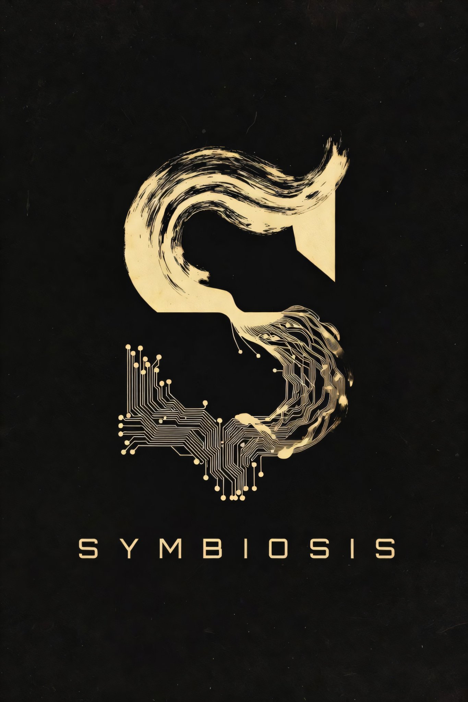

# SYMBIOSIS

> Your LLM has Leonard Shelby's memory problem. Here's the symbiotic architecture I use to fix it.

The sessions keep ending. The next one starts from zero. Context gets re-explained, preferences re-established, decisions re-litigated. Good work gets lost. Bad work gets repeated. The problem isn't the prompt — it's that the model has amnesia and I don't.

**Symbiosis** is a router that connects three layers — character, harness, and a memory system that mirrors cognitive science — bound by a contract that makes the human and the model accountable to each other across sessions. The structure is the tattoos. The contract is what makes them mean something.

The model is the motor. It's swappable — Claude today, something else tomorrow. The architecture isn't.

## How to start

Don't copy these files. Let your model draft yours. The scaffold is the contribution; the content is yours to define.

→ Start with **[the manifesto](symbiosis/)**.

## Symbiosis

- **[The manifesto](symbiosis/)** — full architecture. Layers, four memory domains, two loops, exit criteria. ~15-minute read.
- **[Changelog](symbiosis/CHANGELOG.md)** — version history.

## Skills

- **[Auto Graph Wiki](skills/auto-graph-wiki/)** — Automated regeneration of graph from frontmatter — 20x performance when querying LLM-wikis with NLAH and plain scripts.

- **[Rigorous Reasoning](skills/rigorous-reasoning/)** — A brutal 1st principles intellectual discipline built to destroy the #1 way smart agents fail: Getting more confident the deeper they reason, while being completely wrong.

---

## 💡 How to Contribute

This is an open project! Feel free to:
1.  **Open an Issue** for suggestions or feedback.
2.  **Submit a Pull Request** with your own improved instructions.

## 🛠 Usage
Navigate to a category, copy the Markdown content, and paste it as a System Message or prompt in your favorite AI tool.
